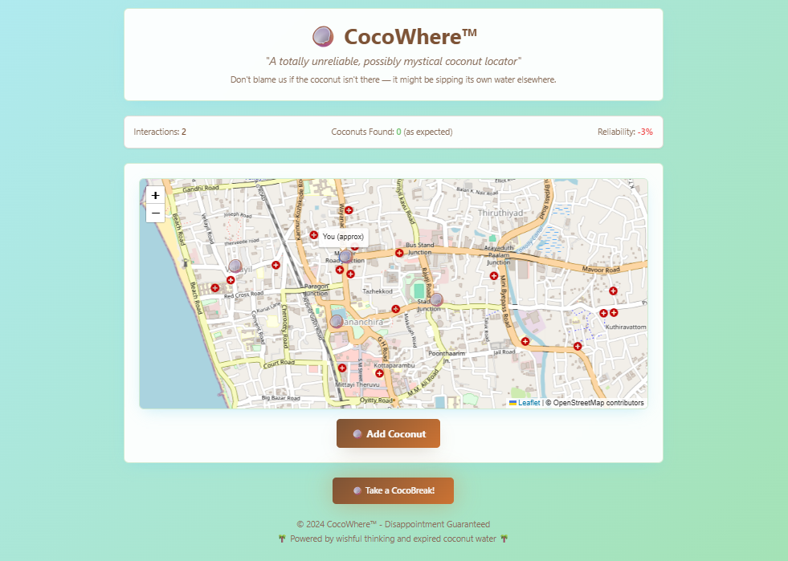
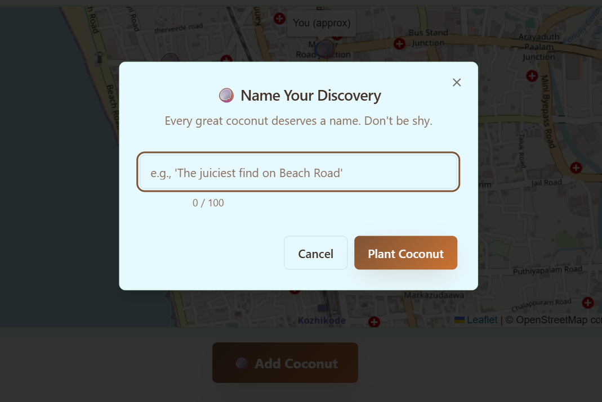
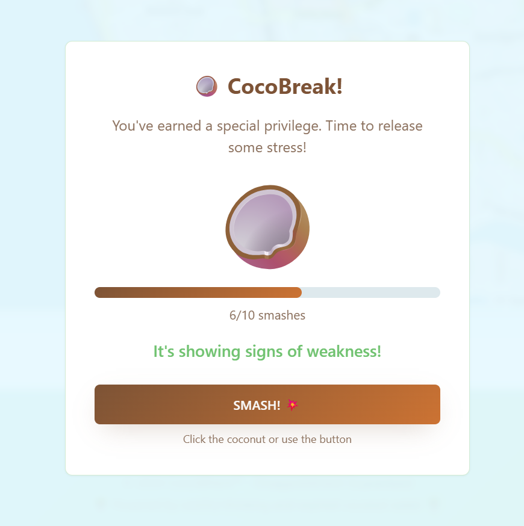

# cocoWhere 🎯

## Basic Details
### Team Name: [Nexus]

### Team Members
- Team Lead: [Pranith M K] - [St. Joseph's College, Devagiri ]
- Member 2: [Sabeel] - [St. Joseph's College, Devagiri ]

### Project Description
CocoWhere is a hilariously unreliable coconut locator game. It pretends to help you find tender coconuts in your city, but in reality, it just lets you place coconuts on a map, click them to view their status, and occasionally roast you for bad coconut etiquette. It also includes a pointless-yet-satisfying CocoBreak coconut smashing mini-game.

### The Problem (that doesn't exist)
People everywhere are plagued by a universal issue — not knowing the exact GPS location of the nearest tender coconut. This has led to countless wasted seconds, minor thirst, coconut rage, and occasional existential dread.

### The Solution (that nobody asked for)
CocoWhere lets users mark coconuts on a map like they’re priceless treasures, click coconuts to check their “status,” and get lightly roasted if they bend the coconut rules. When curiosity (or frustration) peaks, users can enter CocoBreak — a mini-game where they click a coconut until it explodes , achieving nothing except questionable satisfaction.

## Technical Details
### Technologies/Components Used
For Software:
- Languages: JavaScript, TypeScript, HTML
- Frameworks: React
- Libraries: Leaflet.js (for maps), Tailwind CSS, shadcn/ui, lucide-react
- Tools: Vite, Git, VS Code

For Hardware:
- None

### Implementation
For Software:
# Installation
- git clone https://github.com/pranith-mk/cocoWhere.git
- cd cocoWhere
- npm install

# Run
- npm run dev

### Project Documentation
- For Software:
- Gameplay: Users can browse a map, add coconuts, click coconuts to move them around, and receive roast messages when breaking “coconut laws.”

- Special Feature: CocoBreak mini-game lets you “smash” a coconut by clicking it repeatedly until it cracks and turns into a half coconut.

- Player Motivation: Curiosity, humor, and coconut-related stress relief.

# Screenshots (Add at least 3)
 
*Home page showing map and interactive buttons*

 
*marking coconut and adding comment*

 
*users can click the image or button to crack the coconut *

### Project Demo
# Video
[\[ demo video link \]](ulp_video_compressed.mp4)
*This demo walks you through CocoWhere, a quirky coconut-locating web app. You’ll see how to mark coconuts on the map, click them to view their status, and experience the app’s lighthearted roast messages. The video also showcases CocoBreak, a mini-game where you repeatedly click to smash a coconut, trigger an explosion animation, and reveal a half coconut.*

## Team Contributions
- Pranith M K: developed ui
- Sabeel: logic development, deployment

---

Made with ❤️ at TinkerHub Useless Projects 

